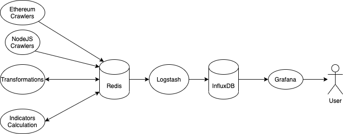

# coinsignal

Calculate all kinds of indicators to assist cryptocurrency trading.

Website: <http://coinsignal.org>

If you want to run this project locally, please read on.

## Quickstart

```bash
docker-compose up
```

Open Grafana at <http://localhost:3000> in browser and login with `admin` and `passw0rd`.

## Architecture



- I tried to use Kafka as the message queue, but it's too heavy, so I used Redis instead.

## Build

```bash
docker build -t soulmachine/coinsignal:crawlers .
```
